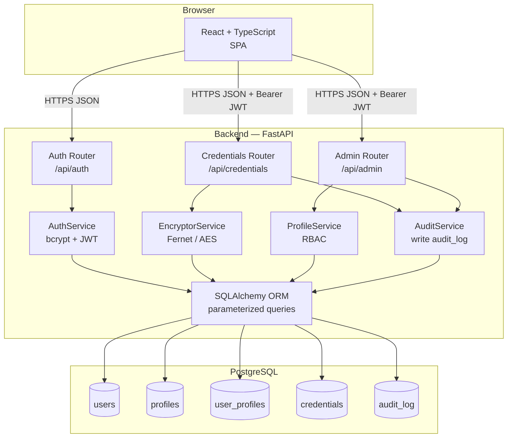
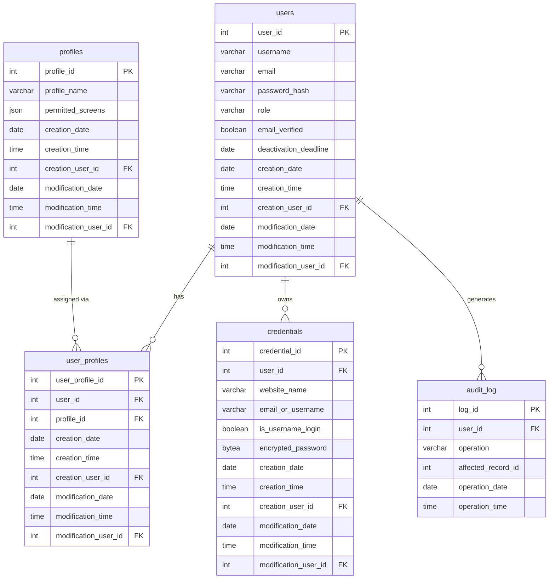
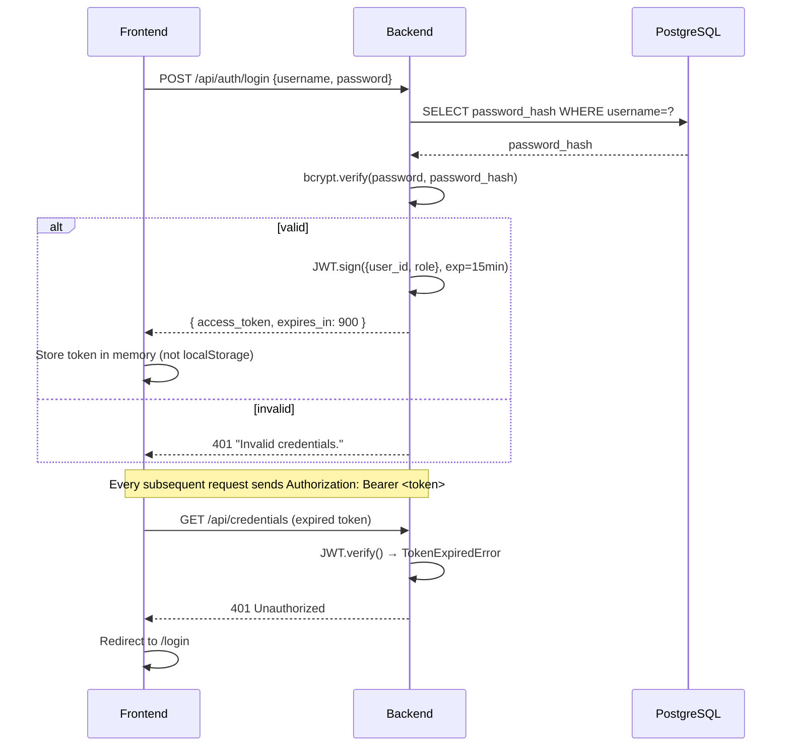

# Design Document — Password Manager Website

## Overview

The password manager website is a full-stack web application that lets authenticated users securely store, retrieve, edit, and delete credentials (website name + login + password). All encryption and decryption happen exclusively on the backend; the frontend never sees an encryption key or an unencrypted password from the database.

The system is built with:

- **Frontend**: React + TypeScript (Vite), using `react-i18next` for EN/ES internationalization.
- **Backend**: Python, FastAPI, SQLAlchemy ORM, `cryptography` (Fernet/AES-128-CBC), `bcrypt` (via `passlib`).
- **Database**: PostgreSQL 15.
- **Auth**: JWT (short-lived access token, HTTPS-only), issued by the backend on successful login.

Two roles exist: **User** and **Admin**. A profile/permission system controls which pages a User may access. The Admin has unrestricted access to every screen and every record.

---

## Architecture

### High-Level Component Diagram



### Request Flow for a Credential Retrieval

```
1. User clicks Eye_Toggle in browser
2. Frontend prompts for account password (Password_Confirmation_Prompt modal)
3. User enters account password → frontend POSTs to /api/credentials/{id}/reveal
   with { "account_password": "..." } + Bearer JWT
4. Backend verifies JWT → extracts user_id
5. Backend fetches user.password_hash from DB
6. Backend verifies bcrypt(account_password, password_hash) → fail → 401
7. Backend fetches credential row (WHERE credential_id = ? AND user_id = ?)
8. Backend calls EncryptorService.decrypt(credential.encrypted_password)
9. Backend writes SELECT entry to audit_log
10. Backend returns { "password": "<plaintext>" } over HTTPS
11. Frontend displays plaintext; starts 60-second Visibility_Timer
12. Timer expires → Frontend masks password (no further backend call needed)
```

### Encryption Lifecycle

```
SAVE:
  plaintext_password  →  Fernet.encrypt(plaintext_password, KEY)  →  encrypted_bytes (stored in DB)

REVEAL:
  encrypted_bytes  →  Fernet.decrypt(encrypted_bytes, KEY)  →  plaintext_password  →  sent over HTTPS  →  displayed briefly

EDIT:
  new_plaintext_password  →  Fernet.encrypt(new_plaintext_password, KEY)  →  new_encrypted_bytes (replaces old row)
```

The `FERNET_KEY` is a 32-byte URL-safe base64 key read from a server-side environment variable. It is never included in any API response or log output.

---

## Components and Interfaces

### Backend Routers

| Router | Base Path | Responsibilities |
|--------|-----------|-----------------|
| `auth_router` | `/api/auth` | Register, login, logout, token refresh, email verification (Phase 2) |
| `credentials_router` | `/api/credentials` | CRUD for credentials; reveal endpoint |
| `admin_router` | `/api/admin` | User listing, profile assignment, audit log view |

### Backend Services

| Service | Key Methods |
|---------|-------------|
| `AuthService` | `register(payload)`, `login(payload) → JWT`, `verify_token(token) → user_id`, `check_account_password(user_id, raw_password) → bool` |
| `EncryptorService` | `encrypt(plaintext: str) → bytes`, `decrypt(ciphertext: bytes) → str` |
| `ProfileService` | `get_user_permissions(user_id) → List[Screen]`, `assign_profile(admin_id, user_id, profile_id)` |
| `AuditService` | `log(user_id, operation, affected_record_id)` |

### Frontend Pages and Routes

| Route | Page Component | Role Required |
|-------|---------------|---------------|
| `/login` | `LoginPage` | Public |
| `/signup` | `SignUpPage` | Public |
| `/credentials` | `ViewSearchPage` | User (with permission) or Admin |
| `/credentials/new` | `SaveCredentialPage` | User (with permission) or Admin |
| `/credentials/:id/edit` | `EditCredentialPage` | User (with permission) or Admin |
| `/admin/users` | `AdminUsersPage` | Admin only |
| `/admin/profiles` | `AdminProfilesPage` | Admin only |

### Frontend Shared Components

| Component | Purpose |
|-----------|---------|
| `PasswordInput` | Masked field + Eye_Toggle |
| `PasswordConfirmModal` | Reusable account-password prompt modal |
| `VisibilityTimer` | Hook + UI countdown for 60 s auto-mask |
| `LanguageToggle` | Header EN/ES switcher |
| `ProtectedRoute` | HOC that checks JWT + Profile permission; redirects to 403 page or login |
| `ConfirmDeleteModal` | Generic confirmation modal for deletions |
| `AlreadyVisibleModal` | Warning modal when another password is already revealed |

---

## Data Models

### Entity-Relationship Diagram



### Table DDL Summaries

```sql
-- users
CREATE TABLE users (
    user_id              SERIAL PRIMARY KEY,
    username             VARCHAR(64)  NOT NULL UNIQUE,
    email                VARCHAR(254) NOT NULL UNIQUE,
    password_hash        VARCHAR(128) NOT NULL,
    role                 VARCHAR(16)  NOT NULL CHECK (role IN ('User','Admin')),
    email_verified       BOOLEAN      NOT NULL DEFAULT FALSE,
    deactivation_deadline DATE,
    -- Audit columns
    creation_date        DATE         NOT NULL,
    creation_time        TIME         NOT NULL,
    creation_user_id     INTEGER      REFERENCES users(user_id),
    modification_date    DATE,
    modification_time    TIME,
    modification_user_id INTEGER      REFERENCES users(user_id)
);

-- profiles
CREATE TABLE profiles (
    profile_id       SERIAL PRIMARY KEY,
    profile_name     VARCHAR(64) NOT NULL UNIQUE,
    permitted_screens JSONB       NOT NULL DEFAULT '[]',
    creation_date        DATE    NOT NULL,
    creation_time        TIME    NOT NULL,
    creation_user_id     INTEGER REFERENCES users(user_id),
    modification_date    DATE,
    modification_time    TIME,
    modification_user_id INTEGER REFERENCES users(user_id)
);

-- user_profiles
CREATE TABLE user_profiles (
    user_profile_id      SERIAL  PRIMARY KEY,
    user_id              INTEGER NOT NULL REFERENCES users(user_id),
    profile_id           INTEGER NOT NULL REFERENCES profiles(profile_id),
    creation_date        DATE    NOT NULL,
    creation_time        TIME    NOT NULL,
    creation_user_id     INTEGER REFERENCES users(user_id),
    modification_date    DATE,
    modification_time    TIME,
    modification_user_id INTEGER REFERENCES users(user_id)
);

-- credentials
CREATE TABLE credentials (
    credential_id        SERIAL  PRIMARY KEY,
    user_id              INTEGER NOT NULL REFERENCES users(user_id),
    website_name         VARCHAR(256) NOT NULL,
    email_or_username    VARCHAR(254) NOT NULL,
    is_username_login    BOOLEAN NOT NULL DEFAULT FALSE,
    encrypted_password   BYTEA   NOT NULL,
    creation_date        DATE    NOT NULL,
    creation_time        TIME    NOT NULL,
    creation_user_id     INTEGER REFERENCES users(user_id),
    modification_date    DATE,
    modification_time    TIME,
    modification_user_id INTEGER REFERENCES users(user_id)
);

-- audit_log
CREATE TABLE audit_log (
    log_id             SERIAL  PRIMARY KEY,
    user_id            INTEGER NOT NULL REFERENCES users(user_id),
    operation          VARCHAR(16) NOT NULL CHECK (operation IN ('SELECT','INSERT','UPDATE','DELETE')),
    affected_record_id INTEGER,
    operation_date     DATE    NOT NULL,
    operation_time     TIME    NOT NULL
);

-- Indexes
CREATE INDEX idx_credentials_user_id        ON credentials(user_id);
CREATE INDEX idx_credentials_website_name   ON credentials(website_name);
CREATE INDEX idx_credentials_email_username ON credentials(email_or_username);
CREATE INDEX idx_audit_log_user_id          ON audit_log(user_id);
```

### Application Database Role

```sql
CREATE ROLE app_user LOGIN PASSWORD '...';
GRANT SELECT, INSERT, UPDATE, DELETE ON ALL TABLES IN SCHEMA public TO app_user;
GRANT USAGE, SELECT ON ALL SEQUENCES IN SCHEMA public TO app_user;
-- No SUPERUSER, no schema ownership
```

### API Request / Response Shapes

#### `POST /api/auth/register`
```json
// Request
{ "username": "alice", "email": "alice@example.com",
  "password": "Secr3t!pass#1", "password_confirmation": "Secr3t!pass#1" }

// Response 201
{ "user_id": 42, "username": "alice", "role": "User" }
```

#### `POST /api/auth/login`
```json
// Request
{ "username": "alice", "password": "Secr3t!pass#1" }

// Response 200
{ "access_token": "<JWT>", "token_type": "bearer", "expires_in": 900 }

// Response 401 (invalid credentials — generic)
{ "detail": "Invalid credentials." }
```

#### `GET /api/credentials?q=github`
```json
// Response 200
[
  { "credential_id": 7, "website_name": "GitHub", "email_or_username": "alice@example.com",
    "is_username_login": false, "password": null }
]
```

#### `POST /api/credentials`
```json
// Request
{ "website_name": "GitHub", "email_or_username": "alice@example.com",
  "is_username_login": false, "password": "myGithubPass1!",
  "account_password": "Secr3t!pass#1" }

// Response 201
{ "credential_id": 7, "website_name": "GitHub" }
```

#### `POST /api/credentials/{id}/reveal`
```json
// Request
{ "account_password": "Secr3t!pass#1" }

// Response 200
{ "password": "myGithubPass1!" }

// Response 401 (wrong account password)
{ "detail": "Account password verification failed." }

// Response 403 (credential belongs to another user)
{ "detail": "Forbidden." }
```

#### `PUT /api/credentials/{id}`
```json
// Request
{ "website_name": "GitHub", "email_or_username": "alice@example.com",
  "is_username_login": false, "password": "newPass2@",
  "account_password": "Secr3t!pass#1" }

// Response 200
{ "credential_id": 7 }
```

#### `DELETE /api/credentials/{id}`
```json
// Request body
{ "account_password": "Secr3t!pass#1" }

// Response 204 (no body)
```

#### `GET /api/admin/users`
```json
// Response 200
[
  { "user_id": 42, "username": "alice", "email": "alice@example.com",
    "role": "User", "profile": { "profile_id": 1, "profile_name": "Basic" } }
]
```

#### `PUT /api/admin/users/{user_id}/profile`
```json
// Request
{ "profile_id": 2 }

// Response 200
{ "user_id": 42, "profile_id": 2 }
```

---

## Authentication and Session Management Flow



JWT Configuration:
- Algorithm: HS256
- Expiry: 15 minutes (access token)
- Transmission: HTTPS only; `Authorization: Bearer` header; token stored in React memory state (not `localStorage` or cookies) to reduce XSS exposure
- Refresh: not in Phase 1; user is redirected to login on expiry

---

## Role and Profile Permission System

```
Role: Admin  →  hardcoded full access, bypasses profile check
Role: User   →  access determined by assigned Profile

Profile row: { profile_id, profile_name, permitted_screens: ["credentials", "credentials.new", ...] }
```

Backend middleware (`require_permission(screen: str)`):
1. Decode JWT → `user_id`, `role`
2. If `role == "Admin"` → allow
3. Else fetch `user_profiles` → `profile.permitted_screens`
4. If `screen` in `permitted_screens` → allow
5. Else → 403 Forbidden

Frontend `ProtectedRoute`:
1. Read JWT from memory → decode claims
2. If role == "Admin" → render children
3. Else call `ProfileService.getMyPermissions()` → check screen key
4. If allowed → render children
5. Else → redirect to `/403`

---

## Internationalization (i18n) Approach

Library: `react-i18next` with `i18next`.

Directory structure:
```
src/
  i18n/
    en.json   ← all English strings keyed by identifier
    es.json   ← all Spanish strings, same keys
  i18n.ts     ← i18next initialization; detects browser language, falls back to "en"
```

`LanguageToggle` component calls `i18n.changeLanguage("es" | "en")` — no page reload. The chosen language is stored in `sessionStorage` so it persists for the browser session but resets on new sessions.

All user-visible text — labels, placeholders, error messages, modal copy — uses `t("key")` from the `useTranslation` hook.

---

## Responsive UI Strategy

Breakpoints (Tailwind CSS defaults, or equivalent CSS variables):

| Breakpoint | Width |
|-----------|-------|
| `sm` | ≥ 640 px |
| `md` | ≥ 768 px |
| `lg` | ≥ 1024 px |
| `xl` | ≥ 1280 px |

Implementation:
- Fluid grid layout: single-column on mobile, two-column on `md+`, sidebar on `lg+`.
- All buttons, inputs, and icon controls have a minimum touch target of 44×44 px on screens < 768 px.
- The credentials table on `ViewSearchPage` is wrapped in a horizontally scrollable container (`overflow-x: auto`) so no columns are clipped on narrow screens.
- Form layouts stack vertically on mobile and align side-by-side on `md+`.

---

## Security Considerations

| Concern | Mitigation |
|---------|-----------|
| SQL injection | SQLAlchemy ORM + parameterized queries exclusively; no raw string interpolation |
| Password storage | bcrypt via `passlib[bcrypt]`; work factor ≥ 12 |
| Credential encryption | Fernet (AES-128-CBC + HMAC-SHA256); key stored in env var, never in code or DB |
| Token security | JWT in memory only (not `localStorage`); short 15-min expiry |
| HTTPS | All traffic over TLS; backend sets `Strict-Transport-Security` header |
| CORS | FastAPI `CORSMiddleware` configured to allow only the known frontend origin |
| Brute-force (Phase 2) | hCaptcha on login form |
| Email verification (Phase 2) | Unique token link; 30-day deactivation deadline |
| Credential ownership | All credential queries include `WHERE user_id = <authenticated_user_id>` |
| Fernet key rotation | Key rotation procedure: re-encrypt all credentials with new key, rotate env var (documented in ARCHITECTURE.md) |
| Audit trail | Every mutation and every credential reveal is logged to `audit_log` |

---

## Audit Logging Design

`AuditService.log(user_id, operation, affected_record_id)` is called synchronously before the API response is returned.

```python
def log(self, user_id: int, operation: str, affected_record_id: int | None):
    entry = AuditLog(
        user_id=user_id,
        operation=operation,           # "SELECT" | "INSERT" | "UPDATE" | "DELETE"
        affected_record_id=affected_record_id,
        operation_date=date.today(),
        operation_time=datetime.utcnow().time(),
    )
    self.db.add(entry)
    self.db.commit()
```

Events logged:

| Operation | Trigger |
|-----------|---------|
| `INSERT` | Credential created |
| `SELECT` | Credential password revealed |
| `UPDATE` | Credential updated |
| `DELETE` | Credential deleted |

---

## Correctness Properties

*A property is a characteristic or behavior that should hold true across all valid executions of a system — essentially, a formal statement about what the system should do. Properties serve as the bridge between human-readable specifications and machine-verifiable correctness guarantees.*

### Property 1: Password Confirmation Match

*For any* pair of strings `(password, confirmation)`, the registration endpoint SHALL accept the submission if and only if `password == confirmation`.

**Validates: Requirements 1.3, 1.4**

---

### Property 2: Password Strength Validation

*For any* candidate password string, the backend validator SHALL reject the string if and only if at least one of the following conditions holds: length < 12, no uppercase letter, no lowercase letter, no digit, or no symbol from `{@, $, !}`.

**Validates: Requirements 1.5, 1.6**

---

### Property 3: Account Password Hashing

*For any* valid registration payload, the value stored in `users.password_hash` SHALL be a valid bcrypt hash AND SHALL NOT equal the plaintext password submitted during registration.

**Validates: Requirements 1.7, 8.5**

---

### Property 4: Audit Columns on Creation

*For any* record created in `users` or `credentials`, the fields `creation_date`, `creation_time`, and `creation_user_id` SHALL all be non-null immediately after creation.

**Validates: Requirements 1.8, 4.11, 9.8**

---

### Property 5: Generic Error on Invalid Login

*For any* login attempt with credentials that do not match a stored user (wrong username, wrong password, or non-existent user), the response body SHALL be the same generic error message, providing no information about which field was incorrect.

**Validates: Requirements 2.3**

---

### Property 6: JWT Issued on Successful Login

*For any* successful login attempt, the response SHALL contain an `access_token` that is a structurally valid JWT with `user_id` and `role` claims and an `exp` claim set within 15 minutes of issue time.

**Validates: Requirements 2.4**

---

### Property 7: Non-Admin Denied Access to Admin Screens

*For any* request to an admin-only endpoint (e.g., `/api/admin/*`) made with a JWT whose `role` claim is `"User"`, the backend SHALL return HTTP 403 Forbidden.

**Validates: Requirements 3.2, 3.4, 3.6**

---

### Property 8: Profile Assignment Updates Audit Columns

*For any* profile assignment operation performed by an Admin, the updated `user_profiles` record SHALL have non-null `modification_date`, `modification_time`, and `modification_user_id` columns set to the current timestamp and the performing admin's `user_id`.

**Validates: Requirements 3.3**

---

### Property 9: Credential Encryption Invariant

*For any* credential password string submitted during a save or edit operation, the value stored in `credentials.encrypted_password` SHALL NOT equal the plaintext string AND SHALL be a valid Fernet token that decrypts back to the original plaintext.

**Validates: Requirements 4.10, 6.7, 8.1**

---

### Property 10: Credential Ownership Isolation

*For any* authenticated user U and any credential C owned by a different user V, all credential endpoints (list, reveal, edit, delete) SHALL deny U access to C and SHALL NOT include C in any response returned to U.

**Validates: Requirements 5.3, 8.2**

---

### Property 11: Search Filter Correctness

*For any* search query string Q and any set of credentials belonging to the authenticated user, every credential returned by `GET /api/credentials?q=Q` SHALL contain Q as a case-insensitive substring in either `website_name` or `email_or_username`.

**Validates: Requirements 5.2**

---

### Property 12: Password Confirmation Always Required for Reveal

*For any* sequence of Eye_Toggle interactions within a single session, each reveal attempt SHALL trigger the `Password_Confirmation_Prompt` — no session-level bypass is permitted.

**Validates: Requirements 5.13**

---

### Property 13: Audit Log Entry on Every Mutation and Reveal

*For any* credential operation (INSERT on save, SELECT on reveal, UPDATE on edit, DELETE on delete), an `audit_log` row SHALL exist with the correct `operation` value, the correct `user_id`, and the correct `affected_record_id` immediately after the operation completes.

**Validates: Requirements 4.12, 5.14, 6.9, 7.7**

---

### Property 14: Wrong Account Password Rejects Sensitive Operations

*For any* sensitive operation (save, reveal, edit, delete) submitted with an incorrect account password, the backend SHALL return a 401 error and SHALL NOT perform the requested mutation or decryption.

**Validates: Requirements 4.9, 6.6, 7.5**

---

### Property 15: Concurrent Operations Preserve Per-User Isolation

*For any* set of simultaneous credential operations by distinct users, no user's operation SHALL read, modify, or delete another user's credentials; each user's final data state SHALL reflect only their own operations.

**Validates: Requirements 8.7**

---

### Property 16: Email Validation Rejects Invalid Formats and Disposable Domains

*For any* string submitted as an email address, the validator SHALL accept the string if and only if it conforms to RFC 5321 format AND its domain is not on the disposable-domain blocklist.

**Validates: Requirements 4.13**

---

## Error Handling

| Scenario | HTTP Status | Response |
|----------|-------------|----------|
| Invalid JWT or missing auth header | 401 | `{"detail": "Not authenticated."}` |
| Expired JWT | 401 | `{"detail": "Token expired."}` |
| Wrong account password on sensitive op | 401 | `{"detail": "Account password verification failed."}` |
| Accessing another user's credential | 403 | `{"detail": "Forbidden."}` |
| Missing profile permission | 403 | `{"detail": "Access denied."}` |
| Resource not found | 404 | `{"detail": "Not found."}` |
| Validation error (pydantic) | 422 | Pydantic error detail |
| Unexpected server error | 500 | `{"detail": "Internal server error."}` (no stack trace in production) |

FastAPI exception handlers are registered globally. Database errors (integrity violations, transaction rollbacks) are caught and re-raised as 500s with the stack trace written to server logs only.

---

## Testing Strategy

### Unit Tests (pytest)

Focus on:
- `EncryptorService.encrypt` / `decrypt` round-trip with fixed and random inputs
- `AuthService.check_account_password` correct and incorrect cases
- Password strength validator: known-failing and known-passing examples
- `ProfileService.get_user_permissions` for User and Admin roles
- `AuditService.log` call verification using mocked DB session

### Property-Based Tests (Hypothesis — Python)

Each test runs a **minimum of 100 iterations**.

Library: [`hypothesis`](https://hypothesis.readthedocs.io/)

Tag format used in test docstrings: `Feature: password-manager-website, Property {N}: {short_text}`

| Test | Property | Iterations |
|------|----------|-----------|
| `test_password_confirmation_match` | Property 1 | 100 |
| `test_password_strength_validation` | Property 2 | 200 |
| `test_account_password_hashing` | Property 3 | 100 |
| `test_audit_columns_on_creation` | Property 4 | 100 |
| `test_generic_error_on_invalid_login` | Property 5 | 100 |
| `test_jwt_issued_on_login` | Property 6 | 100 |
| `test_non_admin_denied_admin_endpoints` | Property 7 | 100 |
| `test_credential_encryption_invariant` | Property 9 | 200 |
| `test_credential_ownership_isolation` | Property 10 | 100 |
| `test_search_filter_correctness` | Property 11 | 200 |
| `test_prompt_always_required_for_reveal` | Property 12 | 100 |
| `test_audit_log_on_every_operation` | Property 13 | 100 |
| `test_wrong_password_rejects_sensitive_ops` | Property 14 | 100 |
| `test_email_validation` | Property 16 | 200 |

Properties 8 (profile audit columns) and 15 (concurrent isolation) use mocked DB sessions and SQLAlchemy in-memory SQLite for property-level isolation; true concurrency is verified in a separate integration test.

### Integration Tests

- Full login → create credential → reveal → edit → delete flow against a test PostgreSQL instance
- Admin profile assignment and permission enforcement end-to-end
- Concurrent writes from two simulated users verify row-level isolation
- Phase 2: email dispatch mock, deactivation deadline enforcement

### Frontend Tests (Vitest + React Testing Library)

- `PasswordInput` Eye_Toggle shows/hides value
- `PasswordConfirmModal` submission calls correct callback
- `VisibilityTimer` masks password after 60 seconds (mocked timers)
- `AlreadyVisibleModal` "Continue" and "Cancel" paths
- `ProtectedRoute` redirects non-permitted users
- `LanguageToggle` switches all `t()` calls without reload

---

## Documentation Files

The repository SHALL include three documentation files:

### `README.md`
User-facing guide covering:
- Project description and key features
- Prerequisites and local setup (Docker Compose or manual)
- Environment variables required (names only, not values)
- How to run the development server and run tests
- Screen-by-screen user guide (Login, Sign-Up, View/Search, Save, Edit, Delete, Admin pages)
- Language switching and responsive use on mobile

### `ARCHITECTURE.md`
Technical reference covering:
- System component diagram
- Encryption lifecycle (Save → Store → Retrieve → Display)
- Authentication and session token flow
- Role and profile permission model
- Database schema overview (tables, relationships, audit columns)
- Fernet key management and rotation procedure
- Audit log structure and querying

### `requirements.md`
Already created — captures all functional and non-functional requirements in EARS notation.
